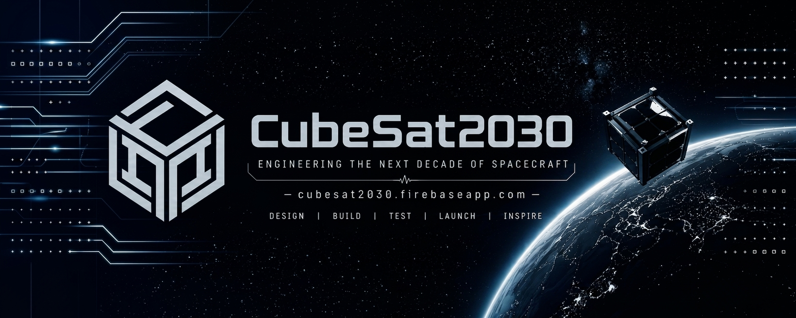

---

## What is CubeSat2030?
CubeSat2030 is an independent spacecraft engineering project focused on the design, development, and advancement of CubeSat-class space systems.

Started in October 2025, the project is currently being developed independently, with the goal of building the knowledge, technologies, and systems required for a future CubeSat mission.

The project explores spacecraft engineering, embedded systems, flight software, electronics, mechanical design, additive manufacturing, robotics, simulation, ground systems, and mission operations.

## Beyond the Workbench

The path toward space doesn't start with a rocket.

It starts with Research & Development.

CubeSat2030 also explores **high-altitude balloon missions** as a way to gain experience with real hardware, sensors, communications, software, and operating payloads outside the normal laboratory environment.

The goal for 2026 CubeSat2030 is developing the skeleton of the OS for the future CubeSat2030 spacecraft, which will be first tested on the CubeSat2030 experimental payload systems which will fly onboard BACAR-14, the 14th high-altitude weather balloon launch by Balloon Carrying Amateur Radio (BACAR), scheduled for 17 October 2026.

These payloads provide open flight-test opportunities to evaluate technologies and systems intended for the future spacecraft under real flight conditions.

These experiments provide an opportunity to learn what happens when a year of R&D work leaves the workbench and enters the stratosphere.

---
You'll find the work that goes into CubeSat2030 here.

" This is where the fun happens... "

---
